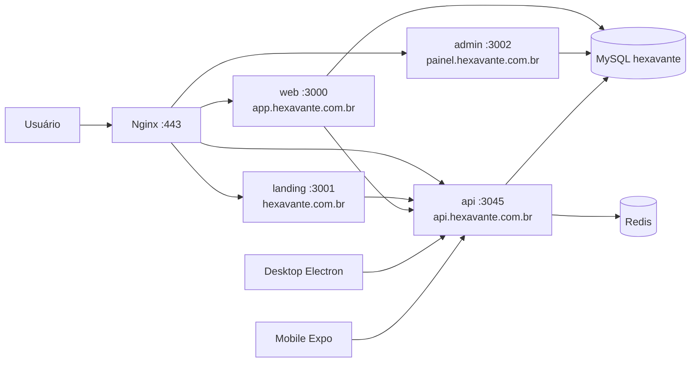

<p align="center">
  
</p>

<p align="center">
  <strong>Plataforma educacional própria, em produção: cursos, simulados, gamificação, certificados e comunidade — web, API, site público, painel, desktop e mobile.</strong><br/>
  <em>Own learning platform in production: courses, exams, gamification, certificates and community.</em>
</p>

<p align="center">
  
  
  
  
  
  
  
  
  
  
  
  
</p>

<p align="center">
  <a href="https://hexavante.com.br">🌐 Site</a> ·
  <a href="https://app.hexavante.com.br">🚀 App</a> ·
  <a href="https://api.hexavante.com.br/api/v1/platform/stats">⚙️ API</a> ·
  <a href="https://painel.hexavante.com.br">🛡️ Painel</a> ·
  <a href="https://github.com/Hexavante">📦 Repositórios</a>
</p>

<p align="center">
  <a href="#-português">🇧🇷 Português</a> · <a href="#-english">🇺🇸 English</a> · <a href="#-ecossistema">Ecossistema</a> · <a href="#-arquitetura">Arquitetura</a> · <a href="#-segurança">Segurança</a> · <a href="#-infra--devops">Infra</a>
</p>

---

<a id="-português"></a>
## 🇧🇷 Português

### Sobre a empresa
A **Hexavante** é uma empresa de tecnologia educacional. Projetamos, construímos e operamos a própria plataforma — do banco ao deploy — com um princípio simples: **mesma conta, mesmos dados, mesma regra de negócio em todos os clientes**.

Atendemos quem estuda **TI, ENEM e vestibulares**, além de instrutores e moderadores que produzem e curam o conteúdo.

```typescript
const hexavante = {
  empresa: "Hexavante",
  tipo: "edtech — plataforma própria em produção",
  publico: ["estudantes TI", "ENEM", "vestibulares", "instrutores", "moderadores"],
  clientes: ["web", "api", "landing", "admin", "desktop", "mobile"],
  stackCore: ["Next.js 16", "Fastify 5", "TypeScript", "Prisma 6", "MariaDB", "Redis"],
  infra: ["VPS", "Docker", "Nginx", "volume de uploads"],
  obsessao: "código que roda de primeira + docs que alguém consegue seguir",
};
```

<a id="-ecossistema"></a>
### 🧩 Ecossistema — os 6 repositórios

| Repositório | Papel | Stack principal | Onde roda |
|---|---|---|---|
| [Hexavante-Web](https://github.com/Hexavante/Hexavante-Web) | App do aluno/instrutor: painel, cursos, tutoriais, simulados, ranking, loja, inventário, certificados, social, DMs, live-rooms, perfil, estatisticas, configurações | Next.js 16 App Router, React 19, Tailwind v4, Prisma, Server Actions | `app.hexavante.com.br` · `:3000` · container `hexavante-app` |
| [Hexavante-Api](https://github.com/Hexavante/Hexavante-Api) | Backend oficial: auth, regras de negócio, catálogos públicos, ranking, loja, certificados, moderação auditada, notificações, Swagger fora de produção | Fastify 5, Zod, Prisma 6, Redis (cache/sessão/rate-limit), Pino, Vitest | `api.hexavante.com.br` · `:3045` · container `hexavante-api` |
| [Hexavante-landing](https://github.com/Hexavante/Hexavante-landing) | Vitrine pública independente: hero + mascote, catálogos, competir (ranking/loja), plataforma, sobre com time do TCC — **só via API, sem Prisma** | Next.js 16 standalone | `hexavante.com.br` · `:3001` · container `hexavante-landing` |
| [Hexavante-admin](https://github.com/Hexavante/Hexavante-admin) | Moderação independente: visão geral, usuários, conteúdo, cursos, tutoriais, simulados/correções, categorias, instrutores, logs, terminal CLI, broadcast, manutenção | Next.js 16, Prisma direto no banco | `painel.hexavante.com.br` · `:3002` · container `hexavante-admin` |
| [Hexavante-Desktop](https://github.com/Hexavante/Hexavante-Desktop) | Cliente Windows/Linux com mesma conta do web (main + renderer, `contextIsolation` ligado) | Electron 33, React 18, Vite, Zustand, React Query | instalador desktop |
| Hexavante-Mobile 🔒 | App Android/iOS (Expo Go no dev, EAS p/ APK/AAB/IPA, token em secure store) 🔒 privado | Expo 57, React Native, expo-router | stores / sideload |

#### Pins
<p align="center">
  <a href="https://github.com/Hexavante/Hexavante-Web"></a>
  <a href="https://github.com/Hexavante/Hexavante-Api"></a>
</p>
<p align="center">
  <a href="https://github.com/Hexavante/Hexavante-landing"></a>
  <a href="https://github.com/Hexavante/Hexavante-admin"></a>
</p>
<p align="center">
  <a href="https://github.com/Hexavante/Hexavante-Desktop"></a>
</p>

<a id="-arquitetura"></a>
### 🏗️ Arquitetura



- **Banco único** `hexavante` (MySQL/MariaDB). Web usa *migrations* versionadas, API usa `db push` — os dois `schema.prisma` com **paridade total** (models, campos, enums, índices). Regra dura: **nunca `--accept-data-loss`**.
- **Landing 100% via API pública** (`API_URL` no server, `NEXT_PUBLIC_API_URL` no browser). Sem Prisma, sem sessão própria, sem importar código do app.
- **Admin lê/escreve via Prisma direto** (ferramenta interna), com links "ver no app".
- **Desktop/Mobile consomem a mesma API** com o mesmo login.
- Uploads do web persistem em volume Docker `hexavante_uploads:/app/public/uploads`.

<a id="-segurança"></a>
### 🔐 Segurança e contas
- Sessão via cookie `__Secure-hexavante.session_token`, domínio `.hexavante.com.br`, validada na API (`GET /api/v1/auth/session`).
- Armadilha clássica documentada: `Response.ok` é `true` para `202` — login com verificação exige checar `status === 202` (`requiresVerification`).
- 2FA por código de e-mail (Resend), código em dispositivo novo, OAuth confia no dispositivo.
- Multiconta, dispositivos conectados, presença (online/ausente/estudando/não perturbe/invisível), rate-limit contra brute-force.
- Admin com sessão própria `hx_admin_session` (30 dias deslizantes) + código de 6 dígitos; app web redireciona `/admin*` para o painel.

### ✨ O que a plataforma faz
- **Cursos:** catálogo moderado, módulos, aulas YouTube/Vimeo/mp4, progresso, materiais, capas com upload.
- **Tutoriais:** vídeos curtos da comunidade, miniaturas, views, tags.
- **Simulados:** objetivas + dissertativas com correção manual, cronômetro, imagens, histórico, recompensa diária de XP.
- **Gamificação:** XP, níveis, moedas, boosters, loja (13 categorias), inventário, ranking por temporada (fallback all-time), conquistas.
- **Certificados:** emissão automática com código verificável + PDF.
- **Social/tempo real:** live-rooms com chat, feed, seguidores, DMs, perfis com cosméticos.
- **16 temas** com modo claro dedicado, Space Grotesk global, classes `hx-*`.

<a id="-infra--devops"></a>
### 🚢 Infra / DevOps
- VPS `187.127.54.55` · checkouts `/opt/hexavante*` · fluxo `fetch + reset --hard origin/main → docker build --no-cache → stop/rm/run` com envs inline (sem `.env` no servidor).
- Nginx: `hexavante.com.br→:3001`, `app.→:3000`, `api.→:3045`, `painel.→:3002`.
- Pós-deploy: `curl` nas páginas/endpoints + `docker logs` sem erro.
- Portas de qualidade antes do "pronto": web/landing `npx next build` · API `npx tsc --noEmit` + `npm test` no módulo tocado.

### 🗺️ Roadmap público
- [x] Web + API + landing + admin em produção
- [x] Desktop e mobile com mesma conta
- [ ] Pacotes de revisão e passes da loja
- [ ] Correção assistida de dissertativas
- [ ] Trilhas por edital (ENEM/vestibulares)

### GitHub Stats
<p align="center">
  
  
</p>
<p align="center">
  
</p>

---

<a id="-english"></a>
## 🇺🇸 English
**Hexavante** is an education technology company. We design, build and operate our own platform — database to deploy — with one account, one dataset and one set of business rules across web, API, public site, moderation panel, desktop and mobile.

- Web (Next.js 16) at `app.hexavante.com.br`, API (Fastify 5) at `api.hexavante.com.br`, landing (standalone Next.js) at `hexavante.com.br`, admin at `painel.hexavante.com.br`, plus Electron desktop and Expo mobile sharing the same API.
- Single MySQL database with strict schema parity, cookie session + 2FA/device verification via Resend, Docker + Nginx on VPS.
- Features: video courses, tutorials, objective + essay exams, XP/levels/coins/shop/season rankings, verifiable PDF certificates, live rooms, social feed, DMs, presence, full moderation.

Repos: [Web](https://github.com/Hexavante/Hexavante-Web) · [Api](https://github.com/Hexavante/Hexavante-Api) · [Landing](https://github.com/Hexavante/Hexavante-landing) · [Admin](https://github.com/Hexavante/Hexavante-admin) · [Desktop](https://github.com/Hexavante/Hexavante-Desktop) · Mobile (private)

---

<p align="center">
  <sub>Hexavante — educação e tecnologia, do banco ao deploy. Cada sprint como produto, não só como entrega.</sub><br/>
  
</p>
