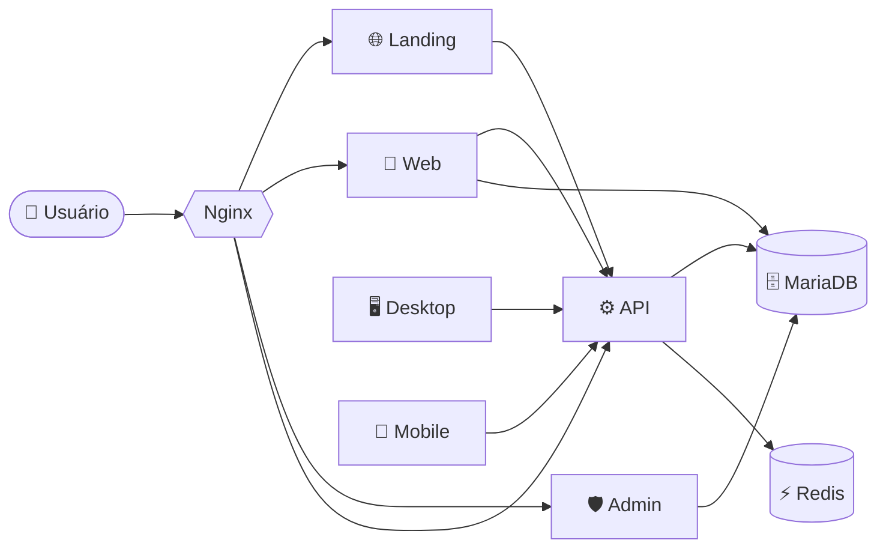

<div align="center">


<a href="https://hexavante.com.br">
  
</a>


<p>
  
  
  
  
</p>

<p>
  
  
  
</p>

**Plataforma educacional open source (MIT), em produção: cursos, simulados, gamificação, certificados e comunidade.**<br/>
<sub>Open-source (MIT) learning platform in production: courses, exams, gamification, certificates and community.</sub>

<br/>

<a href="https://hexavante.com.br"><b>🌐 Site</b></a> &nbsp;·&nbsp;
<a href="https://app.hexavante.com.br"><b>🚀 App</b></a> &nbsp;·&nbsp;
<a href="https://api.hexavante.com.br/api/v1/platform/stats"><b>⚙️ API</b></a> &nbsp;·&nbsp;
<a href="https://painel.hexavante.com.br"><b>🛡️ Painel</b></a> &nbsp;·&nbsp;
<a href="https://github.com/Hexavante"><b>📦 Repositórios</b></a>

</div>

<br/>

<div align="center">

[👋 Comece aqui](#-comece-aqui) ·
[🧭 Sobre](#-sobre) ·
[🧩 Ecossistema](#-ecossistema) ·
[🏗️ Arquitetura](#️-arquitetura) ·
[✨ Recursos](#-recursos) ·
[🔐 Segurança](#-segurança) ·
[🤝 Contribuir](#-open-source-e-como-contribuir) ·
[🗺️ Roadmap](#️-roadmap) ·
[🇺🇸 English](#-english)

</div>

---

## 👋 Comece aqui

| Você é… | Faça isto | Links |
|---|---|---|
| 🎓 **Estudante** | Crie sua conta no site e comece a estudar TI, ENEM e vestibulares | [Site](https://hexavante.com.br) · [App](https://app.hexavante.com.br) |
| 💻 **Dev** | O código é aberto (MIT): explore, use, abra issues e envie PRs. [Como contribuir](#-open-source-e-como-contribuir) | [API](https://api.hexavante.com.br/api/v1/platform/stats) · [Web](https://github.com/Hexavante/Hexavante-Web) · [Api](https://github.com/Hexavante/Hexavante-Api) |
| 🔭 **Curioso(a)** | Veja como as peças se encaixam | [Ecossistema](#-ecossistema) · [Arquitetura](#️-arquitetura) |

---

## 🧭 Sobre

A **Hexavante** é uma empresa de tecnologia educacional. Projetamos, construímos e operamos a nossa própria plataforma, **do banco ao deploy**, atendendo estudantes de **TI, ENEM e vestibulares**, além de instrutores e moderadores que produzem e curam o conteúdo.

O projeto é **aberto ao público e licenciado sob MIT**: você pode estudar, usar, modificar e distribuir o código.

<table align="center">
  <tr>
    <td align="center" width="33%">
      <h3>🔑 Uma conta</h3>
      O mesmo login no web, desktop e mobile.
    </td>
    <td align="center" width="33%">
      <h3>🧠 Uma regra de negócio</h3>
      Toda a lógica vive na API oficial. Nenhum cliente reinventa a roda.
    </td>
    <td align="center" width="33%">
      <h3>🗄️ Um banco</h3>
      Schema único, com paridade total entre os projetos.
    </td>
  </tr>
</table>

> **Nossa obsessão:** código que roda de primeira + documentação que alguém consegue seguir.

---

## 🧩 Ecossistema

Seis repositórios, um produto.

| | Repositório | O que faz | Onde roda |
|:-:|---|---|---|
| 🚀 | [**Hexavante-Web**](https://github.com/Hexavante/Hexavante-Web) | App do aluno e do instrutor: painel, cursos, tutoriais, simulados, ranking, loja, inventário, certificados, social, DMs, live-rooms, perfil e configurações | [`app.hexavante.com.br`](https://app.hexavante.com.br) |
| ⚙️ | [**Hexavante-Api**](https://github.com/Hexavante/Hexavante-Api) | Backend oficial: autenticação, regras de negócio, catálogos públicos, ranking, loja, certificados, moderação auditada e notificações | [`api.hexavante.com.br`](https://api.hexavante.com.br/api/v1/platform/stats) |
| 🌐 | [**Hexavante-landing**](https://github.com/Hexavante/Hexavante-landing) | Vitrine pública independente: catálogos, ranking, loja, plataforma e o time por trás do projeto. Consome **só a API**, sem acesso direto ao banco | [`hexavante.com.br`](https://hexavante.com.br) |
| 🛡️ | [**Hexavante-admin**](https://github.com/Hexavante/Hexavante-admin) | Painel de moderação: usuários, conteúdo, cursos, tutoriais, correções, categorias, instrutores, logs, broadcast e modo manutenção | [`painel.hexavante.com.br`](https://painel.hexavante.com.br) |
| 🖥️ | [**Hexavante-Desktop**](https://github.com/Hexavante/Hexavante-Desktop) | Cliente Windows/Linux com a mesma conta do web | Instalador desktop |
| 📱 | [**Hexavante-Mobile**](https://github.com/Hexavante/Hexavante-Mobile) | App Android/iOS com a mesma conta do web, token em armazenamento seguro | Lojas / sideload |

### 🛠️ Stack

<div align="center">

| Camada | Tecnologias |
|---|---|
| **Frontend** |     |
| **Backend** |     |
| **Dados** |   |
| **Clientes nativos** |     |
| **Infra** |   |

</div>

<div align="center">
  <a href="https://github.com/Hexavante/Hexavante-Web"></a>
  <a href="https://github.com/Hexavante/Hexavante-Api"></a>
</div>

---

## 🏗️ Arquitetura


```mermaid
flowchart LR
    U([👤 Usuário]) --> N{{Nginx}}

    N --> L[🌐 Landing]
    N --> W[🚀 Web]
    N --> A[🛡️ Admin]
    N --> API[⚙️ API]

    D[🖥️ Desktop] --> API
    M[📱 Mobile] --> API
    L --> API
    W --> API

    W --> DB[(🗄️ MariaDB)]
    A --> DB
    API --> DB
    API --> R[(⚡ Redis)]
```

- **Banco único.** O Web usa *migrations* versionadas e a API usa `db push`, com os dois `schema.prisma` em **paridade total** (models, campos, enums e índices). Regra dura: **nunca `--accept-data-loss`**.
- **Landing 100% via API pública.** Sem Prisma, sem sessão própria, sem importar código do app.
- **Admin é ferramenta interna** e acessa o banco direto, com atalhos "ver no app".
- **Desktop e Mobile** consomem a mesma API com o mesmo login.

---

## ✨ Recursos

<details open>
<summary><b>📚 Conteúdo</b></summary>
<br/>

| | |
|---|---|
| **Cursos** | Catálogo moderado, módulos, aulas em YouTube/Vimeo/mp4, progresso, materiais e capas com upload |
| **Tutoriais** | Vídeos curtos da comunidade, com miniaturas, views e tags |
| **Simulados** | Objetivas e dissertativas com correção manual, cronômetro, imagens, histórico e recompensa diária de XP |
| **Certificados** | Emissão automática com código verificável + PDF |

</details>

<details open>
<summary><b>🎮 Gamificação</b></summary>
<br/>

XP · níveis · moedas · boosters · loja com 13 categorias · inventário · ranking por temporada (com fallback all-time) · conquistas

</details>

<details open>
<summary><b>💬 Comunidade e tempo real</b></summary>
<br/>

Live-rooms com chat · feed · seguidores · DMs · perfis com cosméticos · presença (online, ausente, estudando, não perturbe, invisível)

</details>

<details>
<summary><b>🎨 Experiência</b></summary>
<br/>

16 temas com modo claro dedicado · Space Grotesk global · design system próprio (`hx-*`)

</details>

---

## 🔐 Segurança

- **Sessão** validada na API, via cookie seguro compartilhado entre os subdomínios.
- **2FA** por código de e-mail, com verificação em dispositivos novos.
- **Multiconta**, dispositivos conectados e controle de presença.
- **Rate limit** contra brute-force.
- **Moderação auditada**: toda ação administrativa deixa rastro em log.
- **Admin isolado**, com sessão própria e verificação por código.
- **Desktop** com `contextIsolation` ativo e **Mobile** com token em secure store.

---

## 🚢 Engenharia

- **Deploy** em VPS com Docker + Nginx, sempre com build limpo e verificação pós-deploy (endpoints e logs).
- **Portas de qualidade** antes de dizer "pronto": `next build` no web e na landing; `tsc --noEmit` + testes do módulo alterado na API. O mesmo vale para contribuições externas.
- **Documentação como parte da entrega.** Cada sprint é tratada como produto, não só como entrega.

---

## 🤝 Open source e como contribuir

Todo o ecossistema é **público e licenciado sob [MIT](https://opensource.org/license/mit)**. Contribuições são bem-vindas, de correção de typo a funcionalidade nova.

| Quero… | Faça isto |
|---|---|
| 🐛 **Reportar um bug** | Abra uma *issue* no repositório correspondente, com passos para reproduzir |
| 💡 **Sugerir uma ideia** | Abra uma *issue* descrevendo o problema que a ideia resolve |
| 🔧 **Enviar código** | Faça um *fork*, crie uma branch, rode as verificações abaixo e abra um *Pull Request* |
| 📖 **Melhorar a documentação** | PRs de documentação são sempre bem-vindos |
| 🔒 **Reportar uma vulnerabilidade** | Use a aba **Security** do repositório (*private vulnerability reporting*). **Não abra issue pública** |

**Antes de abrir o PR**

```bash
# Web e Landing
npx next build

# API
npx tsc --noEmit && npm test
```

**Regras que valem para todo o ecossistema**
- Os `schema.prisma` do Web e da API precisam continuar em **paridade total**.
- **Nunca** use `--accept-data-loss` em alterações de banco.
- Regra de negócio fica na **API**. Os clientes só consomem.

> A licença MIT vale para o **código**. O nome e a marca **Hexavante**, o logo e o mascote são identidade da empresa.

---

## 🗺️ Roadmap

- [x] Web + API + landing + admin em produção
- [x] Desktop e mobile com a mesma conta
- [ ] Pacotes de revisão e passes da loja
- [ ] Correção assistida de dissertativas
- [ ] Trilhas por edital (ENEM e vestibulares)

---

## 🇺🇸 English

<details>
<summary><b>Read in English</b></summary>
<br/>

**Hexavante** is an education technology company. We design, build and operate our own platform, from database to deploy, with **one account, one dataset and one set of business rules** across web, API, public site, moderation panel, desktop and mobile.

- **Clients:** Web (Next.js 16), public landing (standalone Next.js), admin panel, Electron desktop and Expo mobile, all backed by one Fastify 5 API.
- **Data & security:** a single MySQL/MariaDB database with strict schema parity, Redis for cache/session/rate-limit, cookie sessions with 2FA and new-device verification.
- **Features:** video courses, community tutorials, objective + essay exams, XP/levels/coins/shop/season rankings, verifiable PDF certificates, live rooms, social feed, DMs, presence and full audited moderation.

**Open source:** the whole ecosystem is public under the **MIT license**. Issues and pull requests are welcome. Please report security vulnerabilities privately through the repository's **Security** tab.

**Repos:** [Web](https://github.com/Hexavante/Hexavante-Web) · [Api](https://github.com/Hexavante/Hexavante-Api) · [Landing](https://github.com/Hexavante/Hexavante-landing) · [Admin](https://github.com/Hexavante/Hexavante-admin) · [Desktop](https://github.com/Hexavante/Hexavante-Desktop) · [Mobile](https://github.com/Hexavante/Hexavante-Mobile)

</details>

---

<div align="center">


<sub>Hexavante: educação e tecnologia, do banco ao deploy.</sub><br/>
<sub>Open source sob licença <a href="https://opensource.org/license/mit">MIT</a> · feito com ❤️ no Brasil 🇧🇷</sub><br/>


</div>
